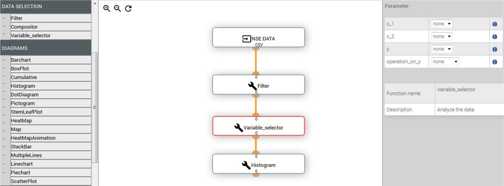

# Self-introduction

## Educational Background

My educational journey to CS, R&D:

* **Secondary School** [2004-2008] Interest started with scripting / Java - games
    * Curious as to how computers work
* **Pioneer JC** [2009-2010] Nurture interest to a passion.
    * Studied H2 Computing - Basics of CS, C++.
    * A*STAR IHPC Quest 2009 (Bronze) - Implement distributed K-Means
* **B.Com. NUS** [2013-2018] Further develop CS, R&D skills.
    * A*STAR Scholarship - Internships working on R&D projects
* **PhD. NUS** [2018-2023] PhD in AI/ML
    * Research is in AI/Machine Learning regarding scaling and robustness.

## Key skills

* **Programming Languages**: Python, C++, Java...
* **Numerical Computing**: NumPy, SciPy, PyTorch...
* **Databases**: Firebase, SQL...
* **Typesetting / Presentation Tools**: LaTex, Markdown (This slides!)...
* **Tools/Platforms**: Git, Mlflow, Plotly, Slurm, GCP...
* **Operating Systems**: Linux (also administration), Windows, macOS

## Service

Contributed in voluntary capacity, service to:

* **Research Community**
    * Reviewer, Student Volunteer, Session Chair
* **National University of Singapore**
    * Admission reviewer (Masters), Program Committee
* **Agency for Science, Technology and Research**
    * Outreach volunteer, Invited speaker, Mentoring
* **Impact Life Church**
    * Head of IT - Manage a volunteer team
    * Software development of Church apps.
    * IT infrastructure/ops.

Keen to contribute above and beyond what is necessary, to improve others/org.

# Working Experiences

## National University of Singapore 

### Teaching Assistant / Graduate Tutor [2018 - 2024]
Teach (> 500 contact hours), while persuing a PhD.

* AI/ML
    * CS2109s - Introduction to AI and Machine Learning
    * CS3243 - Introduction to Artificial Intelligence
* Software Engineering
    * CS3217 - Software Engineering on Modern Application Platforms
    * CS3203 - Software Engineering Project
    * CS2030/CS2030S - Programming Methodology II

Commitment to excellent teaching, effective communication:

* Full-Time Teaching Assistant Award [Apr 23]
* High teaching feedback scores / Nomination rates

## Agency for Science, Technology and Research, IHPC

### A Cloud-based Collaborative Model Building Platform [Dec 15, May 15 - Jun 15]
Design, implement & deploy dockerized, distributed ML platform (before Azure ML)

{width=90%}

## Agency for Science, Technology and Research, IHPC

### Route My Day (Recommendation System) [Jan 13 - Jul 13]
Design, implement & deploy visualization, distributed web crawler & MongoDB.

Improve productivity, optimizing people's time:

1. Select items to do
1. Add locations to visit
1. Finds a route.

Second place for Apps4SG Competition 2013 [8 Jan 2014].

<!-- https://www.imda.gov.sg/resources/press-releases-factsheets-and-speeches/archived/ida/press-releases/2014/new-innovative-apps-expected-to-transform-the-way-we-live-work-and-play-in-singapore -->

# Research

## Statement

I am interested in **scaling** machine learning towards higher dimensions in Bayesian Optimization, Gaussian Processes, Convex and non-convex optimization and Reinforcement Learning. I am also interested in **robustness concerns** in machine learning.

### PhD Research

Bayesian Optimisation Techniques for **High-Dimensional** and **Adversarial** Settings

Advised by: *Asst. Prof. Scarlett Jonathan*

## Introduction

### Optimization

We have a function $f: {\mathcal X} \to \RR$ that we want to \fbox{find $\xmax$} on ${\mathcal X} \subseteq \RR^{\ndim}$:
$$ \xopt = \xmax \in \arg \max_{\xinX} f(x); \quad \fopt = f(\xopt) =\max_{\xinX}f(x) $$

Situations such as tuning the hyper-parameters, ie. AlphaGo: **Unknown**, **High Cost**

### Bayesian Optimization

Bayesian Optimization (BO) is a popular and important technique for \underline{sequential} global optimization of \underline{black-box} functions in a \underline{query efficient} manner.
$$y_i = f(x_i) + \epsilon_i,\quad \epsilon_i \sim\mathcal{N}(0,\sigma^2)$$

After tuning, AlphaGo win-rate improved by \emph{at least} 50\% to 66.5\% in self-play games.

## High Dimensionality in Bayesian Optimization (Method)

  Each lower-dimensional component $f^G: \X^G \to \RR$ is either a 1 or 2-dimensional function defined on the variables in $G$, 
  where $\X^G = \bigtimes_{v\in G} \X_v$.
  \begin{figure}
    \centering
    \includegraphics[height=.2\textheight]{generated_fig/tree-dep-structure.pdf}
    \caption{$h\left(x\right) = h^A(x_1, x_6) + h^B(x_1, x_5) + h^C(x_1, x_4) + h^D(x_3, x_4) + h^E(x_2)$}
  \end{figure}
  \begin{tcolorbox}[title=Our Goal]
    Exploit tree structures (Additive Structure) for efficacy, to mitigate curse of dimensionality.
  \end{tcolorbox}

## High Dimensionality in Bayesian Optimization (Results)

Tree is competitive on both synthetic and real datasets:
  \begin{figure}
    \centering
    \subfloat[Star-$25$, Iter 15]{\includegraphics[width=.20\textwidth]{images/hdbo/learnt_graphs/00014.png}}
    \hfill
    \subfloat[Star-$25$, Iter 30]{\includegraphics[width=.20\textwidth]{images/hdbo/learnt_graphs/00029.png}}
    \hfill
    \subfloat[Star-$25$, Iter 45]{\includegraphics[width=.20\textwidth]{images/hdbo/learnt_graphs/00044.png}}
    \hfill
    \subfloat[Star-$25$, Iter 60]{\includegraphics[width=.20\textwidth]{images/hdbo/learnt_graphs/00059.png}}\\
    \subfloat[Grid-$3$, Iter $15$]{\includegraphics[width=.20\linewidth]{images/hdbo/learnt_graphs/nonrealizable/00014.png}\label{fig:graph-learning-nonrealizable-progress-15}}
    \hfill
    \subfloat[Grid-$3$, Iter $30$]{\includegraphics[width=.20\linewidth]{images/hdbo/learnt_graphs/nonrealizable/00029.png}}
    \hfill
    \subfloat[Grid-$3$, Iter $45$]{\includegraphics[width=.20\linewidth]{images/hdbo/learnt_graphs/nonrealizable/00044.png}\label{fig:graph-learning-nonrealizable-progress-45}}
    \hfill
    \subfloat[Grid-$3$, Iter $60$]{\includegraphics[width=.20\linewidth]{images/hdbo/learnt_graphs/nonrealizable/00059.png}}
    % \caption{Successfully recovering the underlying Additive Structure.}
  \end{figure}

## Adversarial Attacks on BO (Method)

  At time $t$, with random Noise $z_t \sim \N(0,\sigma^2)$, adversarial noise $c_t$ and budget $C$:
  $$y_t  = \underbrace{f(\xv_t) + c_t}_{\mathclap{\tilde{f}(\xv_t)}} + z_t,\qquad\text{where } \sum_{t=1}^n \bars{c_t} \le C,\quad|c_t|\leq B_0.$$

  Types of attack:
  \begin{enumerate}
    \item \fbox{Targeted Attack} - make the player choose actions in a particular region $\targetr$.
    \item Untargeted Attack - make the player's cumulative regret as high as possible.
  \end{enumerate}

  \begin{tcolorbox}[title=Our Goal]
    Examine from an attacker's perspective, focusing on adversarial perturbations.
  \end{tcolorbox}

## Adversarial Attacks on BO (Results)

  \begin{figure}
    \centering
    \includegraphics[height=0.25cm]{images/aabo/1d/Scatter/legend-Scatter-success_rate-norm_cum_c_t.pdf} \label{fig:Legend}\\
    \includegraphics[width=0.32\textwidth]{images/aabo/1d/Scatter/overall_avg_log_log_rev-Scatter-success_rate-norm_cum_c_t.pdf} \label{fig:1d-overall}
    \includegraphics[width=0.32\textwidth]{images/aabo/forrester/Scatter/overall_avg_log_log_rev-Scatter-success_rate-norm_cum_c_t.pdf}\label{fig:forrester-overall}
    \includegraphics[width=0.32\textwidth]{images/aabo/levy_hard/Scatter/overall_avg_log_log_rev-Scatter-success_rate-norm_cum_c_t.pdf} \label{fig:levyhard-overall}
  \end{figure}

\begin{itemize}
  \item \clipping works consistently.
  \item \aggressivesubtraction works, but with higher cost.
  \item \subtractionrnd and \subtractionsq is `in between'.
  \item \subtractionrnd tends to narrowly beat \subtractionsq (due to smooth $h(\xv)$).
\end{itemize}

## Black-box Adversarial Attacks on CNNs (Method)

We pose the \emph{untargeted} attack as a constrained optimization problem, 
  to find the adversarial perturbation $\delta$ where $f(\xv,y,\delta)$ is maximal.
  $$
  \begin{aligned}
  \delta = {\arg\max}_{\delta} f(\xv,y,\delta) \quad&\text{subject to } ||\delta||_p < \epsilon \bigwedge \xv'\in [0,1]^D \\
  &\text{where }f(\xv,y,\delta)= \begin{cases} 
                      0 & \text{if } F(\xv') \neq c \\
                      -1 & \text{otherwise} 
                  \end{cases}
  \end{aligned}
  $$

* $\ell_\infty$ Attack - CNNs are constructed with shift-invariant components.
* $\ell_2$ Attack - Tradeoff in how the CNN is trained

  \begin{tcolorbox}[title=Our Goal]
    Apply domain knowledge to dimensionality reduction to improve success rate.
  \end{tcolorbox}

## Results

```{=latex}
\begin{figure}[ht!]
    \centering
    \frame{\includegraphics[width=.6\linewidth]{images/bbaa/noattack_nnlayers.png}}\\
    \frame{\includegraphics[width=.6\linewidth]{images/bbaa/tile2_nnlayers.png}}\\
    \caption{$\ell_\infty$ Attack}
\end{figure}
\begin{figure}[t]
    \centering
    \includegraphics[height=.2\linewidth]{images/bbaa/slurm/bo_bandits_find_opt/discover_untargeted_inf_cifar10_sfsft_rng/HeatmapParam/Cifar10TV_attack_success-HeatmapParam.pdf}
    \includegraphics[height=.2\linewidth]{images/bbaa/slurm/bo_bandits_find_opt/discover_untargeted_2_e20_imgnet_vgg16_bn_sfsft_rng_sample/HeatmapParam/vgg16_bn_attack_success-HeatmapParam.pdf}
    \caption{$\ell_2$ Attack Heatmap.}
    \label{fig:bbaa-heatmap-successrate}
\end{figure}
```

## Misc Projects

* Reinforcement Learning for Feature Subset Selection
    * Drawbacks does not outweigh benefits
* Scaling Gaussian Processes to large datasets (datapoints) via rearrangement
    * Difficult to obtain rearrangement
    * Few benefits
* Scaling Combinatorial Bayesian Optimization
    * Literature Review

# Career Aspirations

## Career Aspirations @ Huawei

After my PhD, I applied quite broadly to anywhere that I am interested in. 
For a career at Huawei, I am interested to:

* Perform R&D in AI/ML
* Applied Research to Business use case
* Management / Leadership

For the role **LLM R&D Researcher**, I am willing to pick up NLP skills.

<!-- for f in *.pdf ; do convert $f -transparent white $f ; done -->