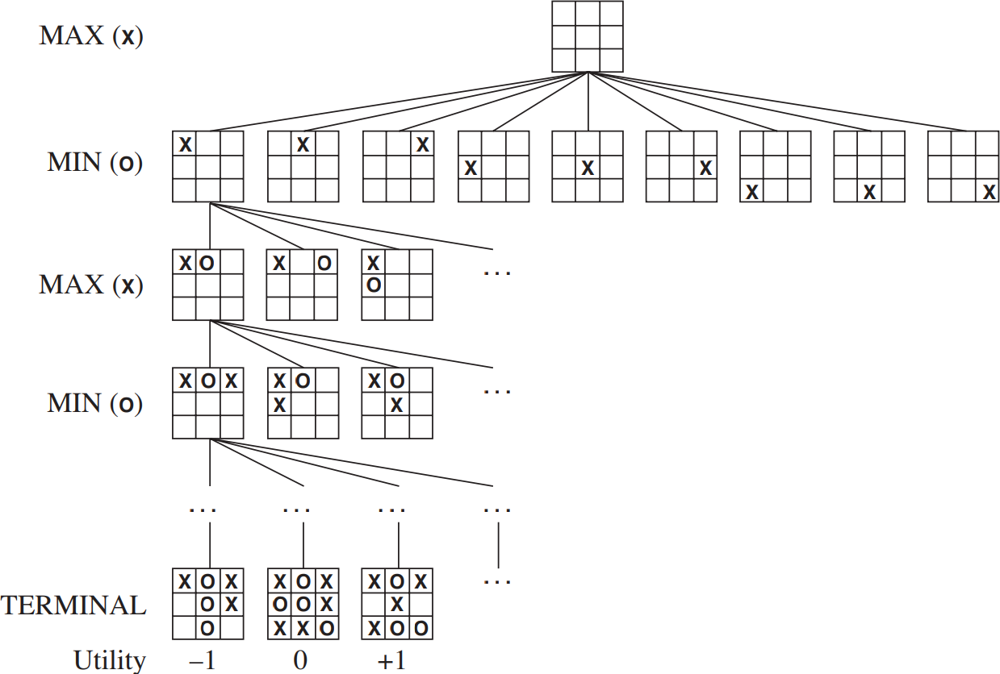

# Introduction

## Experience

<!-- Introduction: Start with a brief introduction of yourself, including your current position and academic background.
Key Achievements: Highlight significant accomplishments, such as degrees earned, research projects, publications, awards, and any notable contributions to your field.
Relevant Experience: Mention any previous teaching positions, industry experience, or relevant work that showcases your expertise. -->

My _Singaporean_ educational journey to CS, R&D:

* [2008] **Secondary School** --- Informal learning; scripting, games
    * *Interest in computing*: why & how computers work
* [2010] **Pioneer JC** --- H2 Computing
    * *Interest in research*: A*STAR IHPC Quest 2009 (Bronze) - K-Means
* [2018] **B.Com. NUS** --- Com. Sci w Honors
    * A*STAR Scholarship: Internships working on R&D projects
* [2024] **PhD. NUS** --- AI/ML tackling scaling and robustness
    * First-author publications in AAAI, ICML.
    * *Interest in teaching*: Fulfilling

Working experiences:

* [2018-2024] **Teaching Assistant/Graduate Tutor, NUS** --- Teach UG
* [B.Com.] **Research Intern, A\*STAR IHPC** --- ML Platform, Rec. Sys.

## Expertise

Support, teach (> 500 contact hours), grade, manage/mentor tutors for:

* AI/Machine Learning
    * **CS2109s** Introduction to AI and Machine Learning
    * **CS3243** Introduction to Artificial Intelligence
* Software Engineering
    * **CS3217** Software Engineering on Modern Application Platforms
    * **CS3203** Software Engineering Project
    * **CS2030/CS2030S** Programming Methodology II

Skilled with Linux (also administration), Windows, macOS:

* **Programming Languages** --- Python, C++, Java, Mojo...
* **Databases** --- Firebase, SQL...
* **Typesetting / Presentation Tools** --- LaTex, Markdown (This slides!)...
* **Tools/Platforms** --- Git, Mlflow, Plotly, Slurm, GCP...

## Teaching Philosophy

Effective learning is driven by an *innate desire* to learn the subject rather than *need*:

1. **Creating a relaxed and safe environment** --- Informal, casual, personal.
1. **Engaging students to facilitate learning in and after class** --- Telegram, buddy
1. **Creating equal opportunities for all students to learn** --- Reaching out

### Teaching Excellence (Tutorials/Recitation)

```{=latex}
\begin{table}[!h]
  \centering
  \begin{tabular}{>{\bfseries}r|cccccccccccccc}
    \toprule
     & \thead{2109} & \thead{2109} & \thead{3243} & \thead{3243} & \thead{3217} & \thead{3203} & \thead{3203} & \thead{3203} & \thead{3203} & \thead{3203}\\
    \midrule
     Score & 4.8 & 4.6 & 4.8 & 4.5 & 3.8 & 4.6 & 4.4 & 4.8 & 4.1 & 3.3 \\
     Resp. & 36 & 13 & 25 & 39 & 6 & 13 & 16 & 18 & 20 & 3 \\
     Nom. & 47\% & 30\% & 32\% & 31\% & 0\% & 61\% & 31\% & 61\% & 10\% & 33\% \\
    \bottomrule
  \end{tabular}
\end{table}
```

## Plans

For the teaching position, I am interested to

- Focus on improving teaching quality
- Contribute anywhere there are needs; Computing, Teaching & Research
- Curriculum development/improvement
- Casual research
    - Mentor for Undergraduate Research / FYP
- Involved in consultancy/policy

# Mini-Lecture

## Recap on environment properties

* **Fully / Partially Observable**: Can the agent see?
* **Single / Multi-Agent**: How many agents?
* **Deterministic / Stochastic**: Is there randomness in transition?
* **Episodic / Sequential**: Is there dependence on previous action?
* **Static / Dynamic**: Can the environment change while the agent is thinking?
* **Discrete / Continuous**: Discretized or varying continuously?

## Recap on formulation

**Un/Informed Search (Path)**: BFS, UCS, DFS, GBFS, A\*

* State space
* Initial state
* Final state
* Action
* Transition

**Local Search (Goal)**: Hill Climbing, Sim. Annealing, Beam, Genetic

* Inital state
* Transition
* Heuristic/Stopping criteria

## Adversarial Search

**Motivation**: How can we win?

Ingredients needed to formulate a problem:

* **Inital state**: Starting configuration (representation)
* **Players**: Decision-makers within the game (2 players)
* **Actions**: Potential moves that the player can make
* **Transition**: Result of a move from a state
* **Terminal/Leaf test**: Checks if the game is over
* **Utility**: Reward for a terminal state and player

## Tic-tac-toe

2P childhood game where $(P_{O},P_{X})$ players take turns drawing their symbols on a 3x3 grid.
The winner is the first player to get 3 of his/her symbol in a row, col. or diag.

 . . . 

$$
\begin{aligned}
\ttt{}{}{}{}{}{}{}{}{}&\xrightarrow{P_{X}}
\ttt{}{X}{}{}{}{}{}{}{}\xrightarrow{P_{O}}
\ttt{O}{X}{}{}{}{}{}{}{}\xrightarrow{P_{X}}
\ttt{O}{X}{}{}{X}{}{}{}{}\xrightarrow{P_{O}}
\ttt{O}{X}{}{}{X}{}{}{O}{}\xrightarrow{P_{X}}
\ttt{O}{X}{}{X}{X}{}{}{O}{}\\
&\xrightarrow{P_{O}}\ttt{O}{X}{}{X}{X}{O}{}{O}{}\xrightarrow{P_{X}}
\ttt{O}{X}{X}{X}{X}{O}{}{O}{}\xrightarrow{P_{O}}
\ttt{O}{X}{X}{X}{X}{O}{O}{O}{}\xrightarrow{P_{X}}
\ttt{O}{X}{X}{X}{X}{O}{O}{O}{X}\xrightarrow{P_{O}}\emptyset
\end{aligned}
$$

 . . . 

\begin{tcolorbox}[title=Recap --- Environment Properties]
  Fully Observable, 2 Agent, Deterministic, Squential, Static, Discrete
\end{tcolorbox}

## Modeling Tic-tac-toe [Discussion]
$$\ttt{}{}{}{}{}{}{}{}{}\xrightarrow{P_{X}}
\ttt{}{X}{}{}{}{}{}{}{}\xrightarrow{P_{O}}
\ttt{O}{X}{}{}{}{}{}{}{}\xrightarrow{P_{X}}
\cdots
\ttt{O}{X}{X}{X}{X}{O}{O}{O}{}\xrightarrow{P_{X}}
\ttt{O}{X}{X}{X}{X}{O}{O}{O}{X}$$

2P childhood game where $(P_{O},P_{X})$ players take turns drawing their symbols on a 3x3 grid.
The winner is the first player to get 3 of his/her symbol in a row, col. or diag.

* **Inital state**: 
* **Players**: 
* **Actions**: 
* **Transition**: 
* **Terminal/Leaf test**: 
* **Utility**: 

## Modeling Tic-tac-toe
$$S_0=\ttt{0}{1}{2}{3}{4}{5}{6}{7}{8}\xrightarrow{a_0=(1,X)}
\ttt{}{X}{}{}{}{}{}{}{}\xrightarrow{\cdots}
\cdots
\ttt{O}{X}{X}{X}{X}{O}{O}{O}{}\xrightarrow{a_8=(8,X)}
\ttt{O}{X}{X}{X}{X}{O}{O}{O}{X} = S_9$$

* **Inital state**: $S_0$, 1D array of $[\emptyset,\emptyset,\emptyset,\emptyset,\emptyset,\emptyset,\emptyset,\emptyset,\emptyset]$; possible elements: $O,X,\emptyset$
* **Players**: $P_X$-max, $P_O$-min
* **$i$-th Actions**: $a_i=(c_i,y): c_i\in[0,8]$ where $S_i[c_i]=\emptyset$, symbol $y\in{X,O}$
* **Transition**: $T(S_i, a_i)=S_{i+1}$, where $S_{i+1}[j]=\begin{cases}
  y & \text{if } j = c_i \\
  S_{i}[j]& \text{otherwise}
\end{cases}$
* **Terminal/Leaf test**: Row, col. or diag having same symbols or no moves
* **Utility**: $U(S_i, p)$ is $0$ if draw, $1$ if $p$ wins, $-1$ if $p$ loses

## Modeling Tic-tac-toe

* **Inital state**: $S_0$, 1D array of $[\emptyset,\emptyset,\emptyset,\emptyset,\emptyset,\emptyset,\emptyset,\emptyset,\emptyset]$; possible elements: $O,X,\emptyset$
* **Players**: $P_X$-max, $P_O$-min
* **$i$-th Actions**: $a_i=(c_i,y): c_i\in[0,8]$ where $S_i[c_i]=\emptyset$, symbol $y\in{X,O}$
* **Transition**: $T(S_i, a_i)=S_{i+1}$, where $S_{i+1}[j]=\begin{cases}
  y & \text{if } j = c_i \\
  S_{i}[j]& \text{otherwise}
\end{cases}$
* **Terminal/Leaf test**: \fbox{Row, col. or diag having same symbols or no moves}
* **Utility**: $U(S_i, p)$ is $0$ if draw, $1$ if $p$ wins, $-1$ if $p$ loses

\begin{tcolorbox}[title=FAQ: Can I describe and not write math?]
  Yes, but it must be \textbf{clear}; ie. Able to translate into code without additional assumptions; you should (at min) describe how the state is represented.
\end{tcolorbox}

## Modeling Tic-tac-toe in Python

* **Inital state**: $S_0$, 1D array of $[\emptyset,\emptyset,\emptyset,\emptyset,\emptyset,\emptyset,\emptyset,\emptyset,\emptyset]$; possible elements: $O,X,\emptyset$
* **$i$-th Actions**: $a_i=(c_i,y): c_i\in[0,8]$ where $S_i[c_i]=\emptyset$, symbol $y\in{X,O}$

~~~python
...
class TicTacToe(object):
  def __init__(self, Si=[ E ] * 9):
    self.Si = Si
  def actions(self):
    e_cis = [ ci for ci, Si_ci in enumerate(self.Si) if Si_ci == E ]
    return [ (ci, y) for y in SYMBOLS for ci in e_cis ]
~~~

Code will be made avaliable: [https://eric-han.com/teaching/demo/ttt.py](https://eric-han.com/teaching/demo/ttt.py)

## Zero-sum game

Zero-sum game is a game where one player gain is equals to another's loss, where the total utility of the game is the **same/constant** (ie. no improvement). 

### Tic-tac-toe is zero-sum

* If $P_X$ wins $P_O$ loses: $\sum U = 1 - 1=0$
* If $P_O$ wins $P_X$ loses: $\sum U = 1 - 1=0$
* If $P_O,P_X$ draws: $\sum U = 0 + 0=0$

So, for Tic-tac-toe: $U(S_i, X) = -U(S_i, O)$

**Intuition**: If you played enough, you notice you keep getting draws.

\begin{tcolorbox}[title=Question]
  Can we come up with an algorithm to play Tic-tac-toe?
\end{tcolorbox}

## Tic-tac-toe gametree

{width=70%}

## Minimax algorithm

**Intuition**: Simulate the game until the end with an imaginary optimal opponent.

$$
\begin{aligned}
\ttt{}{}{}{}{}{}{}{}{}&\xrightarrow{P_{X}}
\ttt{}{X}{}{}{}{}{}{}{}\xrightarrow{P_{O}}
\ttt{O}{X}{}{}{}{}{}{}{}\xrightarrow{P_{X}}
\ttt{O}{X}{}{}{X}{}{}{}{}\xrightarrow{P_{O}}
\ttt{O}{X}{}{}{X}{}{}{O}{}\xrightarrow{P_{X}}
\ttt{O}{X}{}{X}{X}{}{}{O}{}\\
&\xrightarrow{P_{O}}\boxed{\ttt{O}{X}{}{X}{X}{O}{}{O}{}\xrightarrow{P_{X}}
\ttt{O}{X}{X}{X}{X}{O}{}{O}{}\xrightarrow{P_{O}}
\ttt{O}{X}{X}{X}{X}{O}{O}{O}{}\xrightarrow{P_{X}}
\ttt{O}{X}{X}{X}{X}{O}{O}{O}{X}\xrightarrow{P_{O}}\emptyset}
\end{aligned}
$$

I am max player $P_X$, trying to find the best move at $\ttt{O}{X}{}{X}{X}{O}{}{O}{}$

## Minimax algorithm

**Intuition**: Simulate the game until the end with an imaginary opponent.

\begin{figure}
\scalebox{0.6}{
\begin{forest}
[$\ttt{O}{X}{}{X}{X}{O}{}{O}{}$
[$\ttt{O}{X}{X}{X}{X}{O}{}{O}{}$,edge label={node[midway,left,font=\scriptsize]{(2,X)}}
[$\ttt{O}{X}{X}{X}{X}{O}{O}{O}{}$,edge label={node[midway,left,font=\scriptsize]{(6,O)}}
[$\ttt{O}{X}{X}{X}{X}{O}{O}{O}{X}$,edge label={node[midway,left,font=\scriptsize]{(8,X)}}]
]
[$\ttt{O}{X}{X}{X}{X}{O}{}{O}{O}$,edge label={node[midway,left,font=\scriptsize]{(8,O)}}
[$\ttt{O}{X}{X}{X}{X}{O}{X}{O}{O}$,edge label={node[midway,left,font=\scriptsize]{(6,X)}}]
]
]
[$\ttt{O}{X}{}{X}{X}{O}{X}{O}{}$,edge label={node[midway,left,font=\scriptsize]{(6,X)}}
[$\ttt{O}{X}{O}{X}{X}{O}{X}{O}{}$,edge label={node[midway,left,font=\scriptsize]{(2,O)}}
[$\ttt{O}{X}{O}{X}{X}{O}{X}{O}{X}$,edge label={node[midway,left,font=\scriptsize]{(8,X)}}]
]
[$\ttt{O}{X}{}{X}{X}{O}{X}{O}{O}$,edge label={node[midway,left,font=\scriptsize]{(8,O)}}
[$\ttt{O}{X}{X}{X}{X}{O}{X}{O}{O}$,edge label={node[midway,left,font=\scriptsize]{(2,X)}}]
]
]
[$\ttt{O}{X}{}{X}{X}{O}{}{O}{X}$,edge label={node[midway,left,font=\scriptsize]{(8,X)}}
[$\ttt{O}{X}{O}{X}{X}{O}{}{O}{X}$,edge label={node[midway,left,font=\scriptsize]{(2,O)}}
[$\ttt{O}{X}{O}{X}{X}{O}{X}{O}{X}$,edge label={node[midway,left,font=\scriptsize]{(6,X)}}]
]
[$\ttt{O}{X}{}{X}{X}{O}{O}{O}{X}$,edge label={node[midway,left,font=\scriptsize]{(6,O)}}
[$\ttt{O}{X}{X}{X}{X}{O}{O}{O}{X}$,edge label={node[midway,left,font=\scriptsize]{(2,X)}}]
]
]
]
\end{forest}
}
\end{figure}

We can fill in the utility values for the leaf nodes!

## Minimax algorithm

**Utility for X**: $U(S_i, X)$ is $0$ if draw, $1$ if $X$ wins, $-1$ if $X$ loses

\begin{figure}
\scalebox{0.6}{
\begin{forest}
[{$\ttt{O}{X}{}{X}{X}{O}{}{O}{}$},edge label={node[midway,left,font=\scriptsize]{()}}
[{$\ttt{O}{X}{X}{X}{X}{O}{}{O}{}$},edge label={node[midway,left,font=\scriptsize]{(2,X)}}
[{$\ttt{O}{X}{X}{X}{X}{O}{O}{O}{}$},edge label={node[midway,left,font=\scriptsize]{(6,O)}}
[{$U\left(\ttt{O}{X}{X}{X}{X}{O}{O}{O}{X}\right)=0$},edge label={node[midway,left,font=\scriptsize]{(8,X)}}]
]
[{$\ttt{O}{X}{X}{X}{X}{O}{}{O}{O}$},edge label={node[midway,left,font=\scriptsize]{(8,O)}}
[{$U\left(\ttt{O}{X}{X}{X}{X}{O}{X}{O}{O}\right)=1$},edge label={node[midway,left,font=\scriptsize]{(6,X)}}]
]
]
[{$\ttt{O}{X}{}{X}{X}{O}{X}{O}{}$},edge label={node[midway,left,font=\scriptsize]{(6,X)}}
[{$\ttt{O}{X}{O}{X}{X}{O}{X}{O}{}$},edge label={node[midway,left,font=\scriptsize]{(2,O)}}
[{$U\left(\ttt{O}{X}{O}{X}{X}{O}{X}{O}{X}\right)=0$},edge label={node[midway,left,font=\scriptsize]{(8,X)}}]
]
[{$\ttt{O}{X}{}{X}{X}{O}{X}{O}{O}$},edge label={node[midway,left,font=\scriptsize]{(8,O)}}
[{$U\left(\ttt{O}{X}{X}{X}{X}{O}{X}{O}{O}\right)=1$},edge label={node[midway,left,font=\scriptsize]{(2,X)}}]
]
]
[{$\ttt{O}{X}{}{X}{X}{O}{}{O}{X}$},edge label={node[midway,left,font=\scriptsize]{(8,X)}}
[{$\ttt{O}{X}{O}{X}{X}{O}{}{O}{X}$},edge label={node[midway,left,font=\scriptsize]{(2,O)}}
[{$U\left(\ttt{O}{X}{O}{X}{X}{O}{X}{O}{X}\right)=0$},edge label={node[midway,left,font=\scriptsize]{(6,X)}}]
]
[{$\ttt{O}{X}{}{X}{X}{O}{O}{O}{X}$},edge label={node[midway,left,font=\scriptsize]{(6,O)}}
[{$U\left(\ttt{O}{X}{X}{X}{X}{O}{O}{O}{X}\right)=0$},edge label={node[midway,left,font=\scriptsize]{(2,X)}}]
]
]
]
\end{forest}
}
\end{figure}

We know we want the best action later, so we choose the best action (max) there!

## Minimax algorithm

For the best action chosen, we inherit its corresponding value!

\begin{figure}
\scalebox{0.6}{
\begin{forest}
[{$\ttt{O}{X}{}{X}{X}{O}{}{O}{}$},edge label={node[midway,left,font=\scriptsize]{()}}
[{$\ttt{O}{X}{X}{X}{X}{O}{}{O}{}$},edge label={node[midway,left,font=\scriptsize]{(2,X)}}
[{$U\left(\ttt{O}{X}{X}{X}{X}{O}{O}{O}{}\right)=0$},edge label={node[midway,left,font=\scriptsize]{(6,O)}}]
[{$U\left(\ttt{O}{X}{X}{X}{X}{O}{}{O}{O}\right)=1$},edge label={node[midway,left,font=\scriptsize]{(8,O)}}]
]
[{$\ttt{O}{X}{}{X}{X}{O}{X}{O}{}$},edge label={node[midway,left,font=\scriptsize]{(6,X)}}
[{$U\left(\ttt{O}{X}{O}{X}{X}{O}{X}{O}{}\right)=0$},edge label={node[midway,left,font=\scriptsize]{(2,O)}}]
[{$U\left(\ttt{O}{X}{}{X}{X}{O}{X}{O}{O}\right)=1$},edge label={node[midway,left,font=\scriptsize]{(8,O)}}]
]
[{$\ttt{O}{X}{}{X}{X}{O}{}{O}{X}$},edge label={node[midway,left,font=\scriptsize]{(8,X)}}
[{$U\left(\ttt{O}{X}{O}{X}{X}{O}{}{O}{X}\right)=0$},edge label={node[midway,left,font=\scriptsize]{(2,O)}}]
[{$U\left(\ttt{O}{X}{}{X}{X}{O}{O}{O}{X}\right)=0$},edge label={node[midway,left,font=\scriptsize]{(6,O)}}]
]
]
\end{forest}
}
\end{figure}

We dont know how the $P_O$ will play this move, so

* Assume that $P_O$ wants to win and plays optimally like me.
* We imagine that $P_O$ chooses the best action (min) there!

## Minimax algorithm

**Intuition**: Simulate the game until the end with an imaginary *optimal* opponent.

\begin{figure}
\scalebox{1}{
\begin{forest}
[{$\ttt{O}{X}{}{X}{X}{O}{}{O}{}$},edge label={node[midway,left,font=\scriptsize]{()}}
[{$U\left(\ttt{O}{X}{X}{X}{X}{O}{}{O}{}\right)=0$},edge label={node[midway,left,font=\scriptsize]{(2,X)}}]
[{$U\left(\ttt{O}{X}{}{X}{X}{O}{X}{O}{}\right)=0$},edge label={node[midway,left,font=\scriptsize]{(6,X)}}]
[{$U\left(\ttt{O}{X}{}{X}{X}{O}{}{O}{X}\right)=0$},edge label={node[midway,left,font=\scriptsize]{(8,X)}}]
]
\end{forest}
}
\end{figure}

Now I can just pick the move that is the best (max value):

* All 3 moves would, at worse-case, end up in draws.

## Minimax algorithm
<!-- 
{width=65%} -->

\begin{minipage}{.5\linewidth}
  \includegraphics{algorithm/minimax.pdf}
\end{minipage}
\begin{minipage}{.49\linewidth}
\scalebox{.65}{
\begin{forest}
[{$\ttt{O}{X}{}{X}{X}{O}{}{O}{}$},edge label={node[midway,left,font=\scriptsize]{()}}
[{$U\left(\ttt{O}{X}{X}{X}{X}{O}{}{O}{}\right)=0$},edge label={node[midway,left,font=\scriptsize]{(2,X)}}]
[{$U\left(\ttt{O}{X}{}{X}{X}{O}{X}{O}{}\right)=0$},edge label={node[midway,left,font=\scriptsize]{(6,X)}}]
[{$U\left(\ttt{O}{X}{}{X}{X}{O}{}{O}{X}\right)=0$},edge label={node[midway,left,font=\scriptsize]{(8,X)}}]
]
\end{forest}
}

Conceptually, at every level (min or max),
\begin{itemize}
  \item Evaluate all of the successor's values
  \item Pick the action with the best value
\end{itemize}
But we evaluate it in a DFS fashion.

\end{minipage}

## Minimax Tic-tac-toe example

\begin{figure}
\scalebox{.41}{
\begin{forest}
[{$\ttt{}{}{}{}{}{}{}{}{}$},edge label={node[midway,left,font=\scriptsize]{()}}
[{$U\left(\ttt{X}{}{}{}{}{}{}{}{}\right)=0$},edge label={node[midway,left,font=\scriptsize]{(0,X)}}]
[{$U\left(\ttt{}{X}{}{}{}{}{}{}{}\right)=0$},edge label={node[midway,left,font=\scriptsize]{(1,X)}}]
[{$U\left(\ttt{}{}{X}{}{}{}{}{}{}\right)=0$},edge label={node[midway,left,font=\scriptsize]{(2,X)}}]
[{$U\left(\ttt{}{}{}{X}{}{}{}{}{}\right)=0$},edge label={node[midway,left,font=\scriptsize]{(3,X)}}]
[{$U\left(\ttt{}{}{}{}{X}{}{}{}{}\right)=0$},edge label={node[midway,left,font=\scriptsize]{(4,X)}}]
[{$U\left(\ttt{}{}{}{}{}{X}{}{}{}\right)=0$},edge label={node[midway,left,font=\scriptsize]{(5,X)}}]
[{$U\left(\ttt{}{}{}{}{}{}{X}{}{}\right)=0$},edge label={node[midway,left,font=\scriptsize]{(6,X)}}]
[{$U\left(\ttt{}{}{}{}{}{}{}{X}{}\right)=0$},edge label={node[midway,left,font=\scriptsize]{(7,X)}}]
[{$U\left(\ttt{}{}{}{}{}{}{}{}{X}\right)=0$},edge label={node[midway,left,font=\scriptsize]{(8,X)}}]
]
\end{forest}
}
\end{figure}

Computing it out for all possible actions for $S_0$:

* All successor states have values of $U(.)=0$
* All actions would lead to draws
* No matter what you play, Tic-tac-toe is unlosable

\begin{tcolorbox}[title=Intuition from Primary Sch: How can that be?]
  Center is better, corners are next best and then the rest.
\end{tcolorbox}

## Minimax Tic-tac-toe example

\begin{figure}
\scalebox{.41}{
\begin{forest}
[{$\ttt{}{}{}{}{}{}{}{}{}$},edge label={node[midway,left,font=\scriptsize]{()}}
[{$U\left(\ttt{X}{}{}{}{}{}{}{}{}\right)=0$},edge label={node[midway,left,font=\scriptsize]{(0,X)}}]
[{$U\left(\ttt{}{X}{}{}{}{}{}{}{}\right)=0$},edge label={node[midway,left,font=\scriptsize]{(1,X)}}]
[{$U\left(\ttt{}{}{X}{}{}{}{}{}{}\right)=0$},edge label={node[midway,left,font=\scriptsize]{(2,X)}}]
[{$U\left(\ttt{}{}{}{X}{}{}{}{}{}\right)=0$},edge label={node[midway,left,font=\scriptsize]{(3,X)}}]
[{$U\left(\ttt{}{}{}{}{X}{}{}{}{}\right)=0$},edge label={node[midway,left,font=\scriptsize]{(4,X)}}]
[{$U\left(\ttt{}{}{}{}{}{X}{}{}{}\right)=0$},edge label={node[midway,left,font=\scriptsize]{(5,X)}}]
[{$U\left(\ttt{}{}{}{}{}{}{X}{}{}\right)=0$},edge label={node[midway,left,font=\scriptsize]{(6,X)}}]
[{$U\left(\ttt{}{}{}{}{}{}{}{X}{}\right)=0$},edge label={node[midway,left,font=\scriptsize]{(7,X)}}]
[{$U\left(\ttt{}{}{}{}{}{}{}{}{X}\right)=0$},edge label={node[midway,left,font=\scriptsize]{(8,X)}}]
]
\end{forest}
}
\end{figure}

Computing it out for all possible actions for $S_0$:

* All successor states have values of $U(.)=0$
* All actions would lead to draws
* No matter what you play, Tic-tac-toe is unlosable
* Assuming *optimal* opponent

## Minimax analysis

With $b$ branching factor and $m$ max depth,

* Time:
  * $O(b^m)$ (From DFS)
* Space:
  * $O(bm)$ (From DFS)
* Completeness:
  * Yes if finite (From DFS)
* Optimality:
  * Yes on $U(.)$, assuming *optimal* opponent

 . . .

\begin{tcolorbox}[title=Can we do better for Tic-tac-toe?]
  We know that an action cannot be reused!
\end{tcolorbox}

## Minimax Tic-tac-toe analysis

With $b$ branching factor and $m$ max depth,

* States:
  * 1D array of size $9$, with possible $O,X,\emptyset$ elements --- $O(3^9)$
  * Can be reduced further by removing illegal states
* Time:
  * $O(b^m), m=9$
  * $9!$ terminal nodes, so $\sum^9_i i!$ nodes to explore
* Space:
  * $O(bm)$
* Completeness:
  * Yes if finite (From DFS)
* Optimality:
  * Yes on $U(.)$, assuming *optimal* opponent

## Minimax limitations

What happens when:

* Large game trees --- Chess: $N=10^{40}$, $b\sim 35$, Go: $N=2.1\times 10^{170}$, $b\sim 250$

  * Borrowing from IDS --- Max depth/Cutoff
  * Is it necessary to evaluate everything? --- Alpha-Beta Pruning
  * ... (More during tutorials)

* Non-optimal agent or we have randomness --- Games with Dice, 2048, etc...

  * Use statistics to capture randomness --- Expectimax

## Cutoff

**Intuition**: Stop at a time or depth limit.

\begin{figure}
\scalebox{0.6}{
\begin{forest}
[{$\ttt{O}{X}{}{X}{X}{O}{}{O}{}$},edge label={node[midway,left,font=\scriptsize]{()}}
[{$\ttt{O}{X}{X}{X}{X}{O}{}{O}{}$},edge label={node[midway,left,font=\scriptsize]{(2,X)}}
[{$\ttt{O}{X}{X}{X}{X}{O}{O}{O}{}$},edge label={node[midway,left,font=\scriptsize]{(6,O)}}
[{$U\left(\ttt{O}{X}{X}{X}{X}{O}{O}{O}{X}\right)=0$},edge label={node[midway,left,font=\scriptsize]{(8,X)}}]
]
[{$\ttt{O}{X}{X}{X}{X}{O}{}{O}{O}$},edge label={node[midway,left,font=\scriptsize]{(8,O)}}
[{$U\left(\ttt{O}{X}{X}{X}{X}{O}{X}{O}{O}\right)=1$},edge label={node[midway,left,font=\scriptsize]{(6,X)}}]
]
]
[{$\ttt{O}{X}{}{X}{X}{O}{X}{O}{}$},edge label={node[midway,left,font=\scriptsize]{(6,X)}}
[{$\ttt{O}{X}{O}{X}{X}{O}{X}{O}{}$},edge label={node[midway,left,font=\scriptsize]{(2,O)}}
[{$U\left(\ttt{O}{X}{O}{X}{X}{O}{X}{O}{X}\right)=0$},edge label={node[midway,left,font=\scriptsize]{(8,X)}}]
]
[{$\ttt{O}{X}{}{X}{X}{O}{X}{O}{O}$},edge label={node[midway,left,font=\scriptsize]{(8,O)}}
[{$U\left(\ttt{O}{X}{X}{X}{X}{O}{X}{O}{O}\right)=1$},edge label={node[midway,left,font=\scriptsize]{(2,X)}}]
]
]
[{$\ttt{O}{X}{}{X}{X}{O}{}{O}{X}$},edge label={node[midway,left,font=\scriptsize]{(8,X)}}
[{$\ttt{O}{X}{O}{X}{X}{O}{}{O}{X}$},edge label={node[midway,left,font=\scriptsize]{(2,O)}}
[{$U\left(\ttt{O}{X}{O}{X}{X}{O}{X}{O}{X}\right)=0$},edge label={node[midway,left,font=\scriptsize]{(6,X)}}]
]
[{$\ttt{O}{X}{}{X}{X}{O}{O}{O}{X}$},edge label={node[midway,left,font=\scriptsize]{(6,O)}}
[{$U\left(\ttt{O}{X}{X}{X}{X}{O}{O}{O}{X}\right)=0$},edge label={node[midway,left,font=\scriptsize]{(2,X)}}]
]
]
]
\end{forest}
}
\end{figure}


## Cutoff

**Intuition**: Stop at a time or depth limit.

\begin{figure}
\scalebox{0.7}{
\begin{forest}
[{$\ttt{O}{X}{}{X}{X}{O}{}{O}{}$},edge label={node[midway,left,font=\scriptsize]{()}}
[{$\ttt{O}{X}{X}{X}{X}{O}{}{O}{}$},edge label={node[midway,left,font=\scriptsize]{(2,X)}}]
[{$\ttt{O}{X}{}{X}{X}{O}{X}{O}{}$},edge label={node[midway,left,font=\scriptsize]{(6,X)}}]
[{$\ttt{O}{X}{}{X}{X}{O}{}{O}{X}$},edge label={node[midway,left,font=\scriptsize]{(8,X)}}]
]
\end{forest}
}
\end{figure}

Previously, we can *always* propagate the $U(.)$ values, but not now:

* Heuristic^[Must design carefully (More during tutorials)] value for non-terminal states: `UTILITY(state)`
* Add test for cutoff condition: `TERMINAL-TEST(state)`

## Alpha-Beta Pruning algorithm

**Intuition**: Skip if there is *already* a better move found, track using bounds.

* Assign bounds to each of the nodes
* Starting with $[-\infty,\infty]$
* Go from left to right

\begin{figure}
\scalebox{1}{
\begin{forest}
[{$\triangle$}
    [8]
    [$\nabla$
        [0]
        [1]
    ]
    [$\nabla$
        [-1]
        [$\triangle$
            [9]
            [9]
        ]
    ]
]
\end{forest}
}
\end{figure}

Commonly used notation --- $\triangle$: Max, $\nabla$: Min

## Alpha-Beta Pruning algorithm

We start by initalizing $[\infty,\infty]$.

\begin{figure}
\scalebox{1}{
\begin{forest}
[{$\triangle[-\infty,\infty]$}
    [8]
    [$\nabla$
        [0]
        [1]
    ]
    [$\nabla$
        [-1]
        [$\triangle$
            [9]
            [9]
        ]
    ]
]
\end{forest}
}
\end{figure}

## Alpha-Beta Pruning algorithm

Then we discover the leaf node $8$, we update its parent max node to at least $8$.

\begin{figure}
\scalebox{1}{
\begin{forest}
[{$\triangle[8,\infty]$}
    [8]
    [{$\nabla[-\infty,\infty]$}
        [0]
        [1]
    ]
    [$\nabla$
        [-1]
        [$\triangle$
            [9]
            [9]
        ]
    ]
]
\end{forest}
}
\end{figure}

## Alpha-Beta Pruning algorithm

Now we discover leaf node $0$, we update its parent min node to at most $0$.

\begin{figure}
\scalebox{1}{
\begin{forest}
[{$\triangle[8,\infty]$}
    [8]
    [{$\nabla[-\infty,0]$}
        [0]
        [1]
    ]
    [$\nabla$
        [-1]
        [$\triangle$
            [9]
            [9]
        ]
    ]
]
\end{forest}
}
\end{figure}

 . . .

Notice that, from root:

* $\triangle[8,\infty]$ would always prefer the node $8>[-\infty,0]$:
* So, $\nabla[-\infty,0]$ is never explored.
* We will not need to evaluate 1 at all > Pune!

## Alpha-Beta Pruning algorithm

$\triangle[8,\infty]$ would always prefer the node $8>[-\infty,0]$, so we prune leaf node $1$.

\begin{figure}
\scalebox{1}{
\begin{forest}
[{$\triangle[8,\infty]$}
    [8]
    [{$\nabla[-\infty,0]$}
        [0]
        [1,edge={prune}]
    ]
    [{$\nabla[-\infty,\infty]$}
        [-1]
        [$\triangle$
            [9]
            [9]
        ]
    ]
]
\end{forest}
}
\end{figure}

## Alpha-Beta Pruning algorithm

Now we discover leaf node $-1$, we update its parent min node to at most $-1$.

\begin{figure}
\scalebox{1}{
\begin{forest}
[{$\triangle[8,\infty]$}
    [8]
    [{$\nabla[-\infty,0]$}
        [0]
        [1,edge={prune}]
    ]
    [{$\nabla[-\infty,-1]$}
        [-1]
        [$\triangle$
            [9]
            [9]
        ]
    ]
]
\end{forest}
}
\end{figure}

## Alpha-Beta Pruning algorithm

$\triangle[8,\infty]$ would always prefer the node $8>[-\infty,-1]$, so we prune the rest.

\begin{figure}
\scalebox{1}{
\begin{forest}
[{$\triangle[8]$}
    [8]
    [{$\nabla[-\infty,0]$}
        [0]
        [1,edge={prune}]
    ]
    [{$\nabla[-\infty,-1]$}
        [-1]
        [$\triangle$,edge={prune}
            [9]
            [9]
        ]
    ]
]
\end{forest}
}
\end{figure}

## Alpha-Beta Pruning algorithm

* Bounds needs to be checked along the path
* Can we summarize all of the bounds searched so far?
    - $\alpha$: Minimum score that the Max player knows it can guarantee
    - $\beta$: Maximum score that the Min player already knows it can guarantee

\begin{figure}
\scalebox{1}{
\begin{forest}
[{$\triangle[8]$}
    [8]
    [{$\nabla[-\infty,0]$}
        [0]
        [1,edge={prune}]
    ]
    [{$\nabla[-\infty,-1]$}
        [-1]
        [$\triangle$,edge={prune}
            [9]
            [9]
        ]
    ]
]
\end{forest}
}
\end{figure}

## Alpha-Beta Pruning algorithm

* $\alpha$: Minimum score that the Max player knows it can guarantee
* $\beta$: Maximum score that the Min player already knows it can guarantee

\begin{figure}
\scalebox{1}{
\begin{forest}
[{$\triangle[8]$}
    [8]
    [{$\nabla[-\infty,0]$}
        [0]
        [1,edge={prune}]
    ]
    [{$\nabla[-\infty,-1]$}
        [-1]
        [$\triangle$,edge={prune}
            [9]
            [9]
        ]
    ]
]
\end{forest}
}
\end{figure}

Instead of checking if root node would always prefer the node $8>[-\infty,0]$:

* $\alpha=8,\beta=\infty$ is passed in from parent: allowing you to reason along the path.
* Nodes after $0$, ie. node $1$, is pruned because $v$ less eq $\alpha$, ie. $0\leq 8$

## Alpha-Beta Pruning algorithm
<!-- 
{width=45%} -->

\begin{minipage}{.5\linewidth}
  \includegraphics{algorithm/alphabeta.pdf}
\end{minipage}
\begin{minipage}{.49\linewidth}

Conceptually, we use 
\begin{itemize}
  \item $\alpha$: Minimum score that the Max player knows it can guarantee
  \item $\beta$: Maximum score that the Min player already knows it can guarantee
\end{itemize}
to reason on the bounds on nodes to decide if we can prune.

(Tracing during tutorials)

\end{minipage}

## Alpha-Beta analysis

Pruning does not affect result:

* Time: 
  * Worst Case: Same as Minimax
  * Best Case: $O(b^\frac{m}{2})$ for perfect ordering (More during tutorials)
    * Save on static evaluation (evaluating the values) and move generation (generating nodes).
    * Can explore twice as deep on the best case.
* Space: Same as Minimax
* Completeness: Same as Minimax
* Optimality: Same as Minimax

## 2048 

\begin{minipage}{.5\linewidth}
  \includegraphics[width=0.7\linewidth]{2048.png}
\end{minipage}
\begin{minipage}{.49\linewidth}

Play 2048: \url{https://play2048.co/}

\begin{itemize}
  \item Player plays Up, Down, Left or Right
  \item The game will randomly spawn either $2$ or $4$ in one of the empty cells
  \item If there is no empty cells, you lose.
  \item Tiles will fall in that direction
  \item Tiles with same value will be merged
\end{itemize}

\end{minipage}

## Modeling 2048 [Discussion/Exercise]

* **Inital state**: 
* **Players**: 
* **Actions**: 
* **Transition**: 
* **Terminal/Leaf test**: 
* **Utility**: 

How to model the randomness?

 . . .

* Model it adversarially as a min player using minimax
* Model it using expectation $\sum_r{P(r)*U(r)}$ --- Expectimax^[See R&N Section 5.5]
    * Chance nodes, representing each possible outcome

## 2048: Minimax vs Expectimax

![Expectimax1,2 are using different heuristics^[https://cs229.stanford.edu/proj2016/report/NieHouAn-AIPlays2048-report.pdf]](2048-compared.png){width=60%}

## Tic-tac-toe: Minimax vs Expectimax

### Max-Expectation-Max-Expectation...

Minimax will pick any action, but what if we model using a random agent?

$U\left(\ttt{X}{}{}{}{}{}{}{}{}\right)=U\left(\ttt{}{}{X}{}{}{}{}{}{}\right)=U\left(\ttt{}{}{}{}{}{}{X}{}{}\right)=U\left(\ttt{}{}{}{}{}{}{}{}{X}\right)=0.995$

$U\left(\ttt{}{}{}{}{X}{}{}{}{}\right)=0.990$

$U\left(\ttt{}{X}{}{}{}{}{}{}{}\right)=U\left(\ttt{}{}{}{X}{}{}{}{}{}\right)=U\left(\ttt{}{}{}{}{}{X}{}{}{}\right)=U\left(\ttt{}{}{}{}{}{}{}{X}{}\right)=0.987$

## Additional

### Reading 

1. R&N Chapter 5 --- Adversarial Search
1. Alpha-Beta: IBM Deep Blue --- [https://www.sciencedirect.com/science/article/pii/S0004370201001291](https://www.sciencedirect.com/science/article/pii/S0004370201001291)
1. What Game Theory Reveals About Life, The Universe, and Everything --- [https://youtu.be/mScpHTIi-kM?si=CLagrjz3WVi-EkXG](https://youtu.be/mScpHTIi-kM?si=CLagrjz3WVi-EkXG)
1. Expectimax for 2048, `16384: 94%` --- [https://github.com/nneonneo/2048-ai](https://github.com/nneonneo/2048-ai)
1. National Museum of Mathematics Tic-tac-toe --- [https://momath.org/wp-content/uploads/2021/08/Alyssa-Choi-Tic-Tac-Toe.pdf](https://momath.org/wp-content/uploads/2021/08/Alyssa-Choi-Tic-Tac-Toe.pdf)

### Experiment

1. Implement `minimax` in the [https://eric-han.com/teaching/demo/ttt.py](https://eric-han.com/teaching/demo/ttt.py)
1. Slides available [https://eric-han.com/teaching/demo/ttt.pdf](https://eric-han.com/teaching/demo/ttt.pdf)